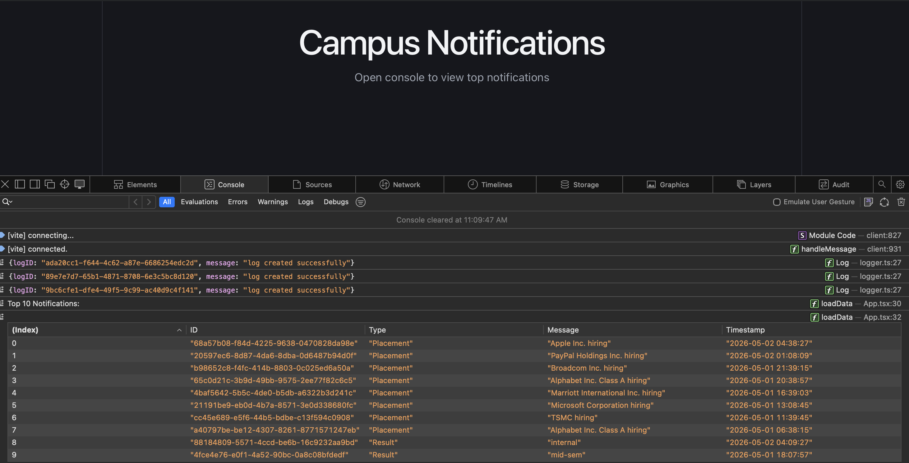

Stage 1
Objective

The goal is to create a Priority Inbox system for campus notifications where users can always see the top 10 most important unread notifications.

Priority is determined using:

Placement > Result > Event

and recency of notifications.

Notification Fetching

Notifications are fetched from the provided protected Notification API using Axios.

The frontend application processes the notifications dynamically without storing them in a database.

Priority Calculation

Each notification type is assigned a weight:

Type	Weight
Placement	3
Result	2
Event	1

The final priority score is calculated using:

priority = weight + recency

More recent notifications receive higher priority.

Top 10 Selection

After calculating priorities:

Notifications are sorted in descending order
The first 10 notifications are selected
These are displayed as the Priority Inbox
Efficient Maintenance of Top 10

Since notifications continuously arrive, sorting the entire dataset repeatedly is inefficient.

To efficiently maintain the top 10 notifications in a real-world scalable system, a:

Min Heap / Priority Queue

approach can be used.

Approach
Maintain a Min Heap of size 10
Insert incoming notifications based on priority
If heap size exceeds 10:
remove lowest priority notification

This ensures only the top 10 highest-priority notifications remain in memory.

Time Complexity
Approach	Complexity
Full Sorting	O(n log n)
Min Heap	O(n log 10)

Since:

log 10 ≈ constant

the heap-based approach is highly efficient for real-time systems.

